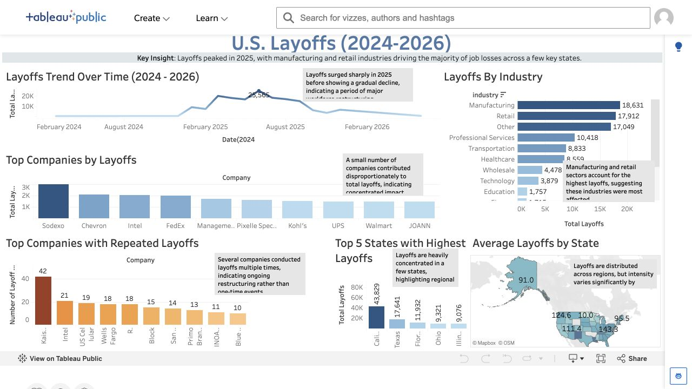

# U.S. Layoffs Analysis (2024-2026)

An end-to-end workforce-reduction analysis that turns raw layoff records into a concise Tableau dashboard for trend, industry, company, and state-level exploration.

## Live dashboard

[Explore the interactive Tableau dashboard](https://public.tableau.com/app/profile/satya.sangeetha.gadam/viz/U_S_Layoffs2024-26/Dashboard1)



## Business questions

- When did reported layoffs peak?
- Which industries experienced the largest reductions?
- Which companies reported the highest totals or repeated events?
- Which U.S. states were most affected?

## Key findings

- Monthly layoffs peaked at **25,565 in June 2025** in the analyzed dataset.
- Manufacturing (**18,631**) and retail (**17,912**) recorded the highest industry totals.
- California led the state totals with **43,829** reported layoffs.
- Kaiser Foundation Hospitals had the most repeated events (**42**), while Sodexo had the highest total among the displayed companies (**3,010**).

## Tools and methods

- **SQL:** aggregation, grouping, date-based analysis, ranking, and repeated-event counts
- **Tableau:** trend lines, ranked bar charts, geographic analysis, labels, and dashboard annotations
- **Excel exports:** saved query results used to validate the dashboard totals

## Repository structure

```text
README.md                  Project overview and findings
dashboard.png              Dashboard preview
layoff_events.xlsx         Company-level event summary
impactedstateslayoff.xlsx  State-level layoff summary
Industryanalysis.xlsx      Industry-level layoff summary
timetrend.xlsx             Monthly layoff trend summary
```

## Notes

The repository contains aggregated result files rather than confidential information. Results reflect the source data available when the dashboard was last refreshed and should be interpreted as descriptive, not causal.
